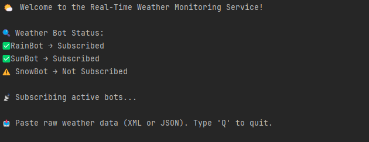
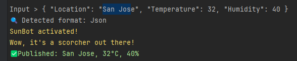
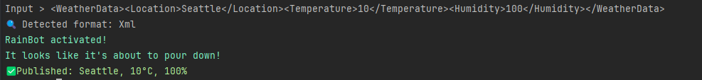
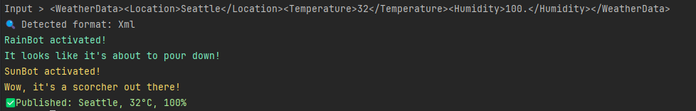
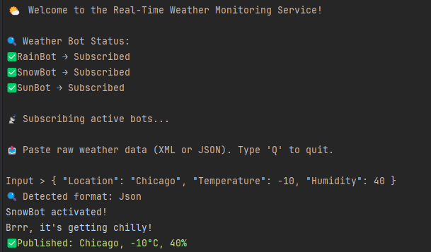
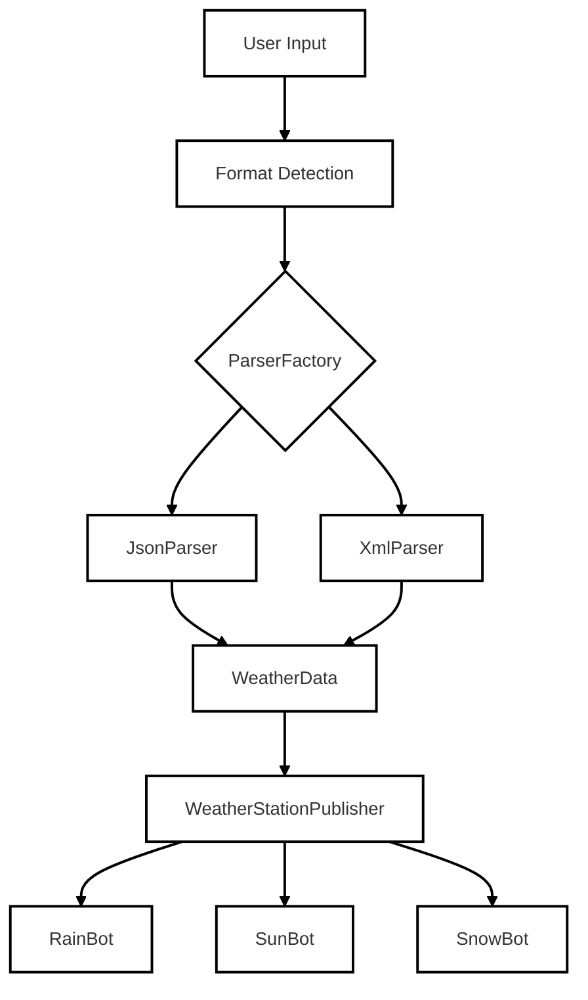
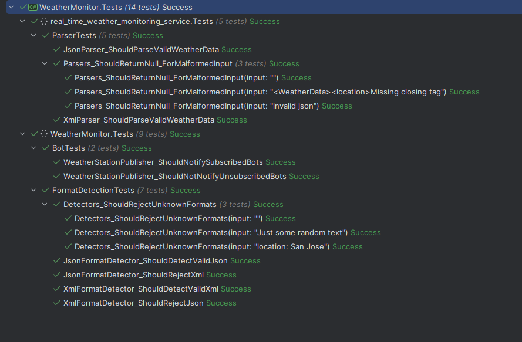

# 🌦️ Real-Time Weather Monitoring Service

## 📌 Project Overview

This C# console application simulates a real-time weather monitoring and reporting system. It ingests weather data from various stations in multiple formats (JSON, XML), dynamically activates weather bots based on configurable thresholds, and demonstrates extensible architecture principles.

## 🌦️ Weather Bot Types

Each bot is activated based on weather thresholds defined in the configuration file:

* **RainBot**: Activates when humidity exceeds its threshold
* **SunBot**: Activates when temperature exceeds its threshold
* **SnowBot**: Activates when temperature drops below its threshold

### Sample Bot Configuration

```json
{
  "RainBot": {
    "enabled": true,
    "humidityThreshold": 70,
    "message": "It looks like it's about to pour down!"
  },
  "SunBot": {
    "enabled": true,
    "temperatureThreshold": 30,
    "message": "Wow, it's a scorcher out there!"
  },
  "SnowBot": {
    "enabled": false,
    "temperatureThreshold": 0,
    "message": "Brrr, it's getting chilly!"
  }
}
```

## 🚀 Features

* Supports multiple input formats: JSON, XML, (YAML-ready via parser extension)
* Modular bot architecture (RainBot, SunBot, SnowBot)
* Configuration-driven behavior and thresholds
* Plug-and-play format detection and parsing
* Extensible design following SOLID principles

## 🖼️ Demonstrations
* ⚡ App Started <br> 
* ✅ JSON input handling (Sun bot activated) <br> 
* 🧾 XML input handling  (Rain bot activated) <br> 
* 🤖 Multi-bot activation based on input (Sun & Rain bots activated) <br> 
* ⛄ Snow-bot activated (enabled in configuration file) <br> 

## 🧩 Architecture Overview



* **Format Detection** routes input to the correct parser via `ParserFactory`
* **Parsers** convert raw input into structured `WeatherData`
* **Publisher** broadcasts updates to subscribed bots
* **Bots** activate based on thresholds defined in `appsettings.json`


## 🧪 Sample Interaction

**Input:**

```json
{ "Location": "San Jose", "Temperature": 32, "Humidity": 40 }
```

**Output:**

```
SunBot activated!
SunBot: "Wow, it's a scorcher out there!"
```

## 📂 Project Structure
```
real-time-weather-monitoring-service/
├── appsettings.json               # Configuration for bots and thresholds
├── Program.cs                     # Entry point of the application
├── real-time-weather-monitoring-service.csproj  # Project file
├── Attributes/
│   └── BotNameAttribute.cs        # Custom attribute to assign names to bots
├── Bots/                          # Bot implementations reacting to weather data
│   ├── IWeatherBot.cs             # Interface for all weather bots
│   ├── RainBot.cs                 # Activates when humidity exceeds threshold
│   ├── SnowBot.cs                 # Activates when temperature drops below threshold
│   └── SunBot.cs                  # Activates when temperature exceeds threshold
├── Enums/
│   └── ParserType.cs              # Enum for supported data formats
├── Factories/
│   ├── ParserFactory.cs           # Creates the appropriate parser based on input
│   └── WeatherBotFactory.cs       # Instantiates bots based on configuration
├── FormatDetection/               # Classes for detecting input data format
│   ├── IFormatDetector.cs         # Interface for format detectors
│   ├── JsonFormatDetector.cs      # Detects JSON formatted input
│   └── XmlFormatDetector.cs       # Detects XML formatted input
├── Helpers/
│   └── ConfigurationInitializer.cs  # Loads and parses app configuration
├── Models/                        # Data structures used across the app
│   ├── WeatherData.cs             # Represents parsed weather data
│   └── Configurations/
│       ├── AppConfig.cs           # Holds app-wide configuration
│       └── WeatherBotConfig.cs    # Holds bot-specific configuration
├── Parsers/                       # Parsers converting raw input into WeatherData
│   ├── IDataParser.cs             # Interface for parsers
│   ├── JsonParser.cs              # Parses JSON input
│   └── XmlParser.cs               # Parses XML input
└── Publishers/
└── WeatherStationPublisher.cs # Publishes weather updates to subscribed bots
```


## ✅ Testing Strategy

Unit tests cover:

* Format detection and parser selection
* Weather data parsing (JSON, XML)
* Bot activation logic based on thresholds
* Configuration loading and validation

Tools used:

* `xUnit` for test scaffolding
* `FluentAssertions` for expressive assertions
* `coverlet` for coverage tracking

Run tests via:

```bash
dotnet test
```



## 🛠️ Quick Start

1. Clone the repository

2. Ensure `.NET 6.0+` is installed
3. Make sure `appsettings.json` is copied to the output directory if newer:
```xml
<ItemGroup>
   <None Update="appsettings.json">
      <CopyToOutputDirectory>PreserveNewest</CopyToOutputDirectory>
   </None>
</ItemGroup>  
```
4. Run the application via CLI:

   ```bash
   dotnet run
   ```

5. Enter Weather Data
   When prompted, enter weather data in **any supported format**:

   ```json
   { "Location": "Seattle", "Temperature": 32, "Humidity": 40 }
   ```

   or

   ```xml
   <WeatherData><Location>Seattle</Location><Temperature>32</Temperature><Humidity>40</Humidity></WeatherData>
   ```

## 🔮 Future Enhancements
* Add structured logging
* CI/CD integration
* Add real API data ingestion
* Add Docker support

